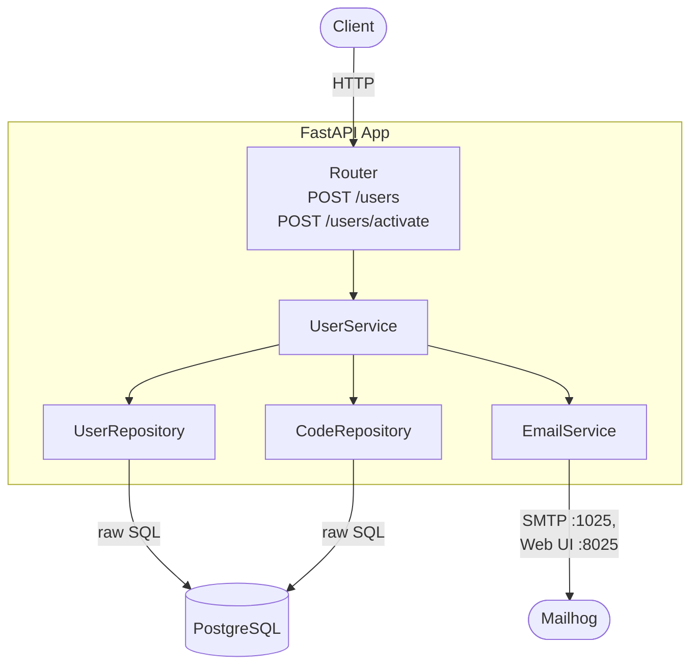

# User Registration API

Dailymotion technical test — a production-quality user registration API with email-based account activation.

**Stack:** Python 3.12 · FastAPI · asyncpg · PostgreSQL · Mailhog · pytest + httpx · uv · Docker

---

## Architecture



### Key design decisions

| Concern | Decision |
|---------|----------|
| Database access | Raw SQL via asyncpg — no ORM |
| Migrations | `schema_migrations` table tracks applied files; idempotent on startup |
| Code expiry | `expires_at` computed DB-side (`NOW() + INTERVAL '1 minute'`) to avoid clock drift |
| Replay prevention | `used_at` timestamp (nullable) — set on first use; codes are single-use |
| Password hashing | bcrypt with constant-time `checkpw` to prevent timing attacks |
| Transaction boundary | Owned by the router layer, not the service |
| Email abstraction | `EmailService` wraps `aiosmtplib`; swap internals for SendGrid/Mailgun without touching other code |
| Dev dependencies | Isolated in `[dependency-groups] dev`; excluded from the production image via `uv sync --no-dev` |

---

## Project structure

```
app/
├── main.py              # App factory, lifespan (pool + http client), router registration
├── config.py            # Settings via pydantic-settings (reads from .env)
├── database.py          # asyncpg pool factory + migration runner
├── dependencies.py      # Depends() providers: get_pool, get_db, get_http_client
├── routers/
│   └── users.py         # POST /users, POST /users/activate
├── schemas/
│   └── user.py          # Pydantic v2: UserCreate, UserResponse, ActivateRequest, MessageResponse
├── services/
│   ├── user_service.py  # register() + activate() orchestration
│   └── email_service.py # aiosmtplib → Mailhog SMTP :1025
├── repositories/
│   ├── user_repository.py   # Raw SQL on users table
│   └── code_repository.py   # Raw SQL on activation_codes table
└── exceptions/
    ├── base.py          # AppException hierarchy (401, 409, 422)
    └── handlers.py      # Global exception handlers registered on the app

migrations/
└── 001_initial.sql      # users + activation_codes DDL

tests/
├── conftest.py          # Per-test DB pool with TRUNCATE isolation, mock email
├── test_register.py
└── test_activate.py
```

---

## API

### `POST /users` — Register

No authentication required.

**Request**
```json
{ "email": "user@example.com", "password": "Secure@pass123" }
```

Password rules: ≥ 12 characters, at least one uppercase, one lowercase, one special character.

**Response `201 Created`**
```json
{ "id": "uuid", "email": "user@example.com", "is_active": false }
```

A 4-digit activation code is sent by email (visible in Mailhog at `http://localhost:8025`).

**Errors**

| Status | Reason |
|--------|--------|
| 409 | Email already registered |
| 422 | Invalid email or weak password |

---

### `POST /users/activate` — Activate account

Requires **HTTP Basic Auth** (email + password).

**Request**
```json
{ "code": "1234" }
```

**Response `200 OK`**
```json
{ "message": "Account activated successfully" }
```

**Errors**

| Status | Reason |
|--------|--------|
| 401 | Unknown user or wrong password |
| 409 | Account already active |
| 422 | Wrong code, expired code, or already-used code |

---

## Running with Docker

### Prerequisites

- Docker + Docker Compose

### Start everything

```bash
docker compose build
docker compose up -d
```

Services started:
- **app** → `http://localhost:8000`
- **postgres** → `localhost:5432`
- **mailhog** → SMTP `:1025` · Web UI `http://localhost:8025`

### Smoke test

```bash
# 1. Register
curl -s -X POST http://localhost:8000/users \
  -H "Content-Type: application/json" \
  -d '{"email":"test@example.com","password":"Secure@pass123"}'

# 2. Open Mailhog to get the 4-digit code
open http://localhost:8025

# 3. Activate (replace 1234 with the real code)
curl -s -X POST http://localhost:8000/users/activate \
  -u "test@example.com:Secure@pass123" \
  -H "Content-Type: application/json" \
  -d '{"code":"1234"}'
```

---

## Running tests

### In Docker (CI mode)

```bash
docker compose -f docker-compose.yml -f docker-compose.test.yml up --abort-on-container-exit
```

Uses a separate `userdb_test` database. Exit code reflects test result.

### Locally

```bash
# 1. Install dependencies (creates .venv automatically)
uv sync

# 2. Start postgres container
docker compose up postgres -d

# 3. Copy and adjust env if needed
cp .env.example .env   # DATABASE_URL uses localhost by default

# 4. Run tests
uv run pytest tests/ -v
```

---

## Local development (VS Code)

```bash
# 1. Installs all deps including dev group into .venv
uv sync

# 2. Run container excpet app 
docker compose up postgres mailhog -d

# 3. Copy and adjust env if needed
cp .env.example .env

# 4. Launch locally the app with auto-reload
uv run uvicorn app.main:app --reload      

```

Then select the `.venv` interpreter in VS Code (`Python: Select Interpreter` → `./.venv/bin/python`).

## Makefile Command (on Linux/MacOs)

For more convenience:

```bash
# Local dev
make dev

# Local test
make test

# Up docker
make docker-up

# Down docker 
make docker-down

# Docker test
make docker-test
```
